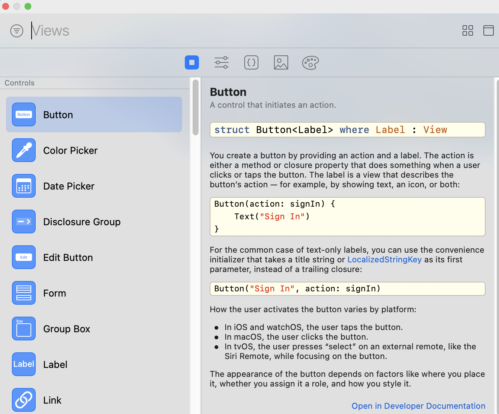

# Browsing the SwiftUI View Library

Hold down the Option key and click the Add button to open the SwiftUI view library. Option-clicking the Add button will keep the library window open until you close it.

If the library window shows code snippets instead of SwiftUI view, make sure you have a SwiftUI view file open and have the preview canvas open. The preview canvas must be open for the library window to show SwiftUI views.
