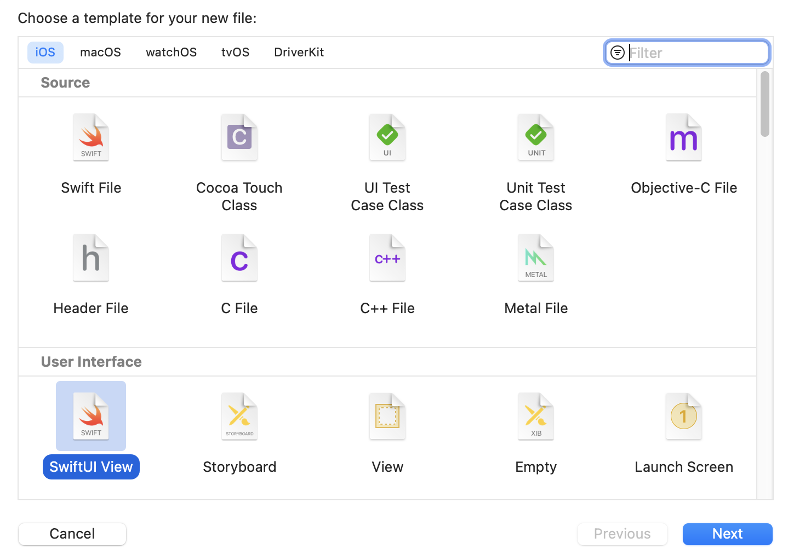
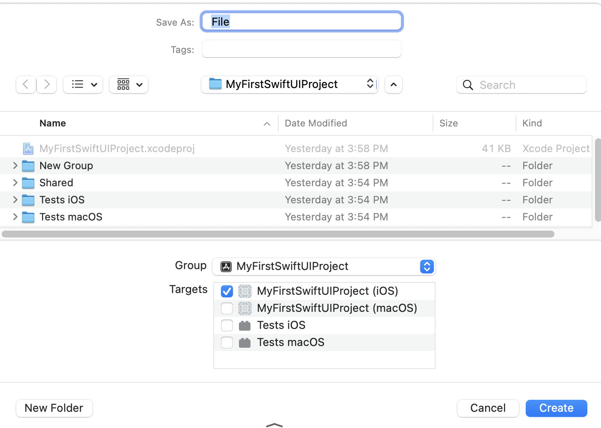

# Creating Xcode Projects

The first step to creating a SwiftUI app is to create a project in Xcode. This section walks you through creating your first Xcode project.

## Step 1: Choose a Project Template

In Xcode choose File > New > Project to create a new project. The New Project Assistant opens.

The first step in choosing a project template. At the top of the New Project Assistant are a series of buttons representing the various platforms. The Multiplatform section is for creating SwiftUI apps that run on iOS and Mac. Selecting a platform shows the available projects you can create for that platform. You're going to be creating application projects in this guide.

If you click on Multiplatform, iOS, and Mac, you will see each of these platforms has App and Document App templates to choose from. The Document App template is for creating apps that let people create documents to share with other people, such as text editors, spreadsheets, and video editors. The App template is for creating any other type of app.

Click on the Mulitplatform button at the top of the New Project Assistant. Select the App template and click the Next button.

## Step 2: Choose Project Options

Enter the name of the project in the Product Name text field. The project name is also the name of the app.

Choose a team.

Enter an identifier for your organization in the Organization Identifier text field. The identifier takes the following form:

	com.CompanyName
	
Where `CompanyName` is the name of your organization. If you have no organization, you can use your name. There should be no spaces in the organization identifier.

Choose SwiftUI from the Interface menu to use SwiftUI for your app. If you do not see an Interface menu, the project will use SwiftUI.

You may see a Life Cycle menu in your version of Xcode. Choose SwiftUI App from that menu to use the SwiftUI app life cycle.

Choose Swift from the Language menu.

The Use Core Data checkbox determines whether or not to use Core Data to store data in your app. Core Data is not for beginners so you will deselect this checkbox when starting to write SwiftUI apps.

Selecting the Include Tests adds unit testing targets to the project. This guide does not cover unit testing, but it does no harm to include tests. Having unit test targets will not make your app bigger or run slower.

Click the Next button to move on to the final step.

## Step 3: Choose a Location to Save

The last step is to choose a location to save your project. Click the Create button to finish creating the project.

You should see a checkbox to create a git repository for the project. Creating a git repository will place your project under version control. Creating a git repository is your choice. If you want to know more about version control, I have [a book about it](https://www.swiftdevjournal.com/version-control-book/).

## The Project Contents

The following screenshot shows the initial files for a multiplatform app project:

The most interesting file is the `ContentView` file. It contains the SwiftUI view.

The Assets folder is where you place icons and any other graphics your app needs.

### Adding Files to the Project

If you are making a really simple app, you can stick with the files Xcode creates when you create a new project. But  eventually you're going to add new files to your project.

Choose File > New > File or hold down the Command key and press N to create a new file and add it to your project. When you tell Xcode to create a file, the New File Assistant opens.

When creating SwiftUI apps, the two files you are most likely to create are Swift files and SwiftUI views. Swift files and SwiftUI view files are the same on iOS and Mac. Click the Next button to move to the next step.

Choose a location to save the file and click the Create button to finish creating the file.

In the screenshot you will see a list of targets to add the target. This target list is important if you're developing a multiplatform SwiftUI. You have to decide if you want the file to be part of the iOS app, the Mac app, or both. The only files that should be added to unit test targets are unit test case classes and UI test case classes.

If you make a mistake with target membership, select the file from the project navigator on the left side of the project window. Open the file inspector on the right side of the project window by choosing View > Inspectors > File. The file inspector has target membership checkboxes for you to either add a file to a target or remove a file from a target.

### Adding a Group to the Project Navigator

Let's take another look at the project navigator screenshot for a newly created project.

The Shared folder contains files that will be used in both the iOS and Mac apps. You might be wondering where you should place files that will be used for only one of the Mac apps. The multiplatform document app template includes iOS and Mac folders. You will have to create your own groups in Xcode. Select the project file from the project navigator on the left side of the project window, hold down the Control key, click, and choose New Group to add a group. Create one group for the iOS app and another for the Mac app.

Select the project file from the project navigator on the left side of the project window, hold down the Control key, click, and choose New Group to add a group.

