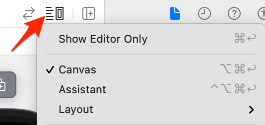

# Previewing SwiftUI Views

If you open the `ContentView` file, you should see the following code at the end of the file:

```
struct ContentView_Previews: PreviewProvider {
    static var previews: some View {
        ContentView()
    }
}
```

This code is preview code that works with Xcode's preview canvas. The canvas lets you see how the view looks without having to build and run the project.

## Showing and Hiding the Canvas

The preview canvas appears in the editor next to your code. If you do not see the canvas, click the button on the right side of the tab bar above the editor and make sure Canvas is selected.



Clicking the button is also the way to turn off the canvas.
